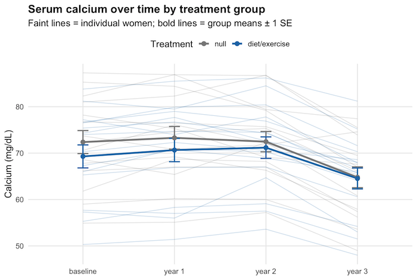
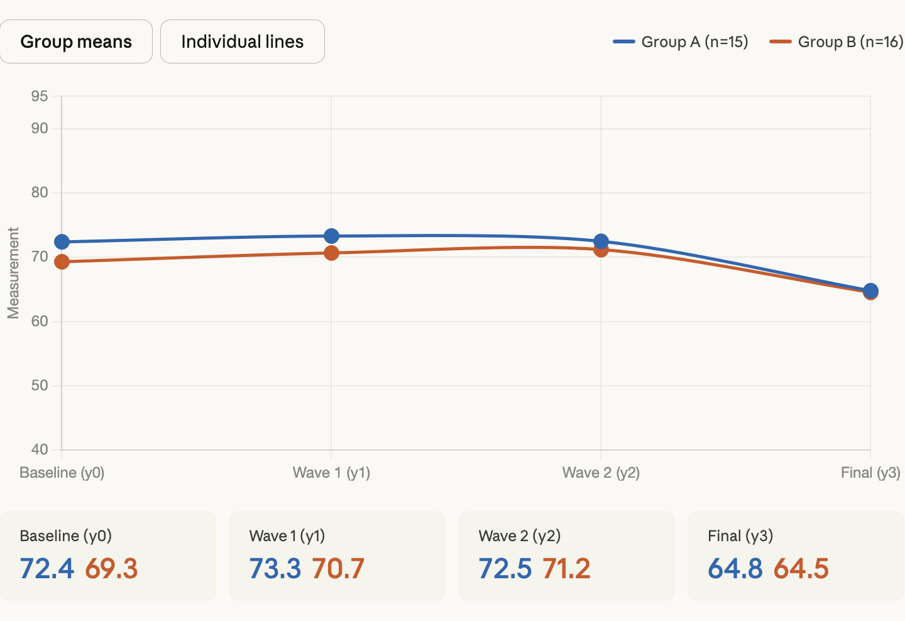

```{r}
#| label: setup
#| include: false

# Load Packages -
## Author: George Dayoub

library(rvest)
library(dplyr)
library(tidyr)
library(knitr)
library(kableExtra)
library(ggplot2)
library(tidyverse)
```

```{r}
#| label: airportsWrangle
#| include: false

## Author: George Dayoub

# read the wikipedia page
url <- "https://en.wikipedia.org/wiki/List_of_busiest_airports_by_passenger_traffic"
page <- read_html(url)

# only grab the wikipedia data tables
tables <- page %>%
  html_elements("table.wikitable") %>%
  html_table(fill = TRUE)

# grab the yearly tables and add the year
t2025 <- tables[[1]] %>% mutate(year = 2025)
t2024 <- tables[[2]] %>% mutate(year = 2024)
t2023 <- tables[[3]] %>% mutate(year = 2023)
t2022 <- tables[[4]] %>% mutate(year = 2022)
t2021 <- tables[[5]] %>% mutate(year = 2021)
t2020 <- tables[[6]] %>% mutate(year = 2020)

# combine all years into one dataset
airports <- bind_rows(t2025, t2024, t2023, t2022, t2021, t2020)

# clean and organize the data
airports_tidy <- airports %>%
  filter(!is.na(Airport)) %>%   # remove empty rows
  select(Airport, Totalpassengers, year) %>%   # keep only needed columns
  rename(passengers = Totalpassengers) %>%     # rename passenger column
  mutate(
    passengers = gsub(",", "", passengers),         # remove commas
    passengers = gsub("\\[.*\\]", "", passengers),  # remove citation numbers like the random number in [19]
    passengers = as.numeric(passengers)             # turn text into numbers
  ) %>%
  filter(Airport %in% c(
    "Hartsfield–Jackson Atlanta International Airport",
    "Frankfurt Airport",
    "Beijing Daxing International Airport",
    "Dubai International Airport",
    "Tokyo Haneda Airport",
    "Dallas Fort Worth International Airport"
  ))
```

# Busiest Airports Analysis
\hrule


## Overview

Looking at both @tbl-airports and @fig-airports you can see that all the 
airports go up over time and the table helps show exactly the numbers of it. 
The graph makes it easier to see as the growth is visibly easier than looking 
at all the numbers.Starting from 2020 everything increases over time which makes sense 
because that was during the covid pandemic and travel was heavily restricted.
Atlanta is the biggest the whole time represented it as it's the biggest and 
Dubai and Dallas and Tokyo are pretty close and also are growing. Frankfurt is 
lower than them with Beijing as well. From my goal it shows that Atlanta is the 
fastest and biggest and that Beijing and Frankfurt are lower, some numbers were 
not available to the Beijing which could affect it. But the main pattern is 
everything is going up and growing but some airports grow faster and have more 
people than others.

## Table

```{r}
#| label: tbl-airports
#| tbl-cap: "Passenger Traffic for Six Busiest Airports, 2020-2025"
#| tbl-pos: H
#| html-table-processing: none

## Author: George Dayoub

# use tidy airport data from the last question
airports_table <- airports_tidy %>%

# spread the year values across columns
  pivot_wider(
    names_from = year,      #make each year its own column
    values_from = passengers # those columns with passenger values
  ) %>%

# sort from a-z by airport name
  arrange(Airport)

# use kable to print the table nicely
kable(airports_table)
```

## Plot


```{r}
#| label: fig-airports
#| fig-cap: "Passenger Traffic for Six Busiest Airports, 2020-2025"
#| fig-pos: H
#| fig-width: 8
#| fig-height: 5
#| fig-alt: "A line graph showing how passenger traffic changed at six major airports between 2020 and 2025. All six airports saw passenger numbers rise over time with Hartsfield Jackson Atlanta consistently leading as the busiest airport each year."

## Author: George Dayoub

# start with the tidy airport data from the last question
airports_tidy %>%
  # set up the graph
  ggplot(aes(x = year, y = passengers, color = Airport, group = Airport)) +
  
# add lines so i can see how each airport changes over time
  geom_line() +  # geom_line for line plot
  
# add points for each airport in each year
  geom_point() +
  # add labels so it makes sense
  labs(
    title = "Passenger Traffic for Six Busiest Airports, 2020-2025",
    x = "Year",
    y = "Passengers",
    color = "Airport"
  ) +
  scale_x_continuous(breaks = c(2020, 2021, 2022, 2023, 2024, 2025)) +

  # make it look cleaner like what i did for first 2 questions 
  theme_minimal()
```


# Monte Carlo Numerical Integration
\hrule

## The Method

Monte Carlo integration is a way to estimate the area under a curve using 
random points. Instead of using a deterministic method like Riemann Sums you 
randomly sample points inside a rectangle that surrounds the function. You 
then check how many of those points fall on or below the curve and how many 
fall above it. The proportion of points that are on or below the curve 
multiplied by the area of the rectangle gives you an estimate of the integral. 
The more points you use the better and more stable the estimate gets.

## Visualization

```{r}
#| label: mcFunction
#| include: false

## Author: George Dayoub

#' MonteCarlo sim function
#'
#' his function runs a Montecarlo simulation by generating random points
#' within given x and y bounds and estimating the area under a function
#'
#' @param n number of random points
#' @param xmin minimum x value
#' @param xmax maximum x value
#' @param ymin minimum y value
#' @param ymax maximum y value
#'
#' @return a data frame with x, y, function values, flags, and estimate
#' @examples
#' mc_simulation(1000, 2, 6, 0, 4)

# name
mc_simulation <- function(n, xmin, xmax, ymin, ymax) {
  
  # n = how many random points i want
  # xmin and xmax = x bounds
  # ymin and ymax = y bounds
  
  x <- runif(n, min = xmin, max = xmax)  # make random x values in the x interval
  y <- runif(n, min = ymin, max = ymax)  # make random y values in the y interval
  
  # define the function
  fx <- -(x - 4)^2 + 4
  
  # rectangle area
  rect_area <- (xmax - xmin) * (ymax - ymin)
  
  # flag each point
  flag <- ifelse(y <= fx, "on/below", "above")
  
  # find the proportion of points on or below the curve
  prop_under <- mean(flag == "on/below")
  
  # estimate the integral
  estimate <- rect_area * prop_under
  
  # combine into one data frame
  points_df <- data.frame(
    x = x,
    y = y,
    fx = fx,
    flag = flag,
    estimate = estimate
  )
  
  return(points_df)
}
```

```{r}
#| label: mcWrangle
#| include: false

## Author: George Dayoub

# calculates the rectangle area
rect_area <- (20 - 0) * (0.16 - 0)

# n = 10
points10 <- mc_simulation(10, 0, 20, 0, 0.16)
points10 <- points10 %>%
  mutate(
    fx = dchisq(x, df = 5),  # plug x into the correct function
    flag = ifelse(y <= fx, "on/below", "above")  # check if point is under the curve
  )
# get the estimate for n = 10
estimate10 <- rect_area * mean(points10$flag == "on/below")

# n = 100
points100 <- mc_simulation(100, 0, 20, 0, 0.16)
points100 <- points100 %>%
  mutate(
    fx = dchisq(x, df = 5),  # plug x into the correct function
    flag = ifelse(y <= fx, "on/below", "above")  # check if point is under the curve
  )
# get the estimate for n = 100
estimate100 <- rect_area * mean(points100$flag == "on/below")

# n = 1000
points1000 <- mc_simulation(1000, 0, 20, 0, 0.16)
points1000 <- points1000 %>%
  mutate(
    fx = dchisq(x, df = 5),  # plug x into the correct function
    flag = ifelse(y <= fx, "on/below", "above")  # check if point is under the curve
  )
# get the estimate for n = 1000
estimate1000 <- rect_area * mean(points1000$flag == "on/below")

# n = 10000
points10000 <- mc_simulation(10000, 0, 20, 0, 0.16)
points10000 <- points10000 %>%
  mutate(
    fx = dchisq(x, df = 5),  # plug x into the correct function
    flag = ifelse(y <= fx, "on/below", "above")  # check if point is under the curve
  )
# get the estimate for n = 10000
estimate10000 <- rect_area * mean(points10000$flag == "on/below")
```

```{r}
#| label: fig-montecarlo
#| fig-cap: "Monte Carlo Numerical Integration of Chi-Square (df=5) at Four Resolutions"
#| fig-pos: H
#| fig-height: 4
#| fig-width: 8
#| layout-ncol: 2
#| fig-subcap:
#|   - "n = 10"
#|   - "n = 100"
#|   - "n = 1000"
#|   - "n = 10000"
#| fig-alt:
#|   - "Monte Carlo simulation of chi-square df 5 at n = 10. Points colored by above or on/below the curve with the estimate shown."
#|   - "Monte Carlo simulation of chi-square df 5 at n = 100. Points colored by above or on/below the curve with the estimate shown."
#|   - "Monte Carlo simulation of chi-square df 5 at n = 1000. Points colored by above or on/below the curve with the estimate shown."
#|   - "Monte Carlo simulation of chi-square df 5 at n = 10000. Points colored by above or on/below the curve. Estimate becomes more accurate as sample size increases."

## Author: George Dayoub

# plots everything so i can actually see what's happening

# n = 10
ggplot(points10, aes(x = x, y = y, color = flag)) +
  geom_point(alpha = 0.5) +  # plot random points
  stat_function(fun = dchisq, args = list(df = 5), xlim = c(0, 20), color = "red") +  # plot the actual function
  labs(
    title = paste("n = 10, Estimate =", round(estimate10, 4)),
    x = "x",
    y = "y",
    color = "Point Type"
  ) +
  theme_minimal()

# n = 100
ggplot(points100, aes(x = x, y = y, color = flag)) +
  geom_point(alpha = 0.5) +  # plot random points
  stat_function(fun = dchisq, args = list(df = 5), xlim = c(0, 20), color = "red") +  # plot the actual function
  labs(
    title = paste("n = 100, Estimate =", round(estimate100, 4)),
    x = "x",
    y = "y",
    color = "Point Type"
  ) +
  theme_minimal()

# n = 1000
ggplot(points1000, aes(x = x, y = y, color = flag)) +
  geom_point(alpha = 0.5) +  # plot random points
  stat_function(fun = dchisq, args = list(df = 5), xlim = c(0, 20), color = "red") +  # plot the actual function
  labs(
    title = paste("n = 1000, Estimate =", round(estimate1000, 4)),
    x = "x",
    y = "y",
    color = "Point Type"
  ) +
  theme_minimal()

# n = 10000
ggplot(points10000, aes(x = x, y = y, color = flag)) +
  geom_point(alpha = 0.5) +  # plot random points
  stat_function(fun = dchisq, args = list(df = 5), xlim = c(0, 20), color = "red") +  # plot the actual function
  labs(
    title = paste("n = 10000, Estimate =", round(estimate10000, 4)),
    x = "x",
    y = "y",
    color = "Point Type"
  ) +
  theme_minimal()
```

## Analysis

The small multiple in @fig-montecarlo shows how the estimate gets better as 
the number of points increases. When n = 10 and 100 the estimates are kinda 
off and jump around a lot but once you get to 1000 and 10000 they start to 
settle and stay close to the same value. The estimates in the last two plots 
are both really close to 1 and that tells me the actual value of the integral 
is about 1.


# Planning and Prompting GenAI Tools
\hrule

## Plan

**Goal:**
\hrule

- tidy the calcium data so it can be used to make a plot
- make a plot that shows how calcium levels change over time for both 
treatment groups so we can compare them

**Needs:**

\hrule

Nouns: calcium.csv, treatment group, time point, calcium measurement, 
woman id, tidy data, plot

Verbs: load, pivot, combine, label, plot, compare

**Steps:**
\hrule
1. load the calcium.csv file into R
2. the first 4 columns are the null group and the second 4 are the 
diet/exercise group so i need to separate them
3. add a treatment column to each group saying either null or diet/exercise
4. add a woman id column to keep track of each woman
5. pivot both groups longer so that the time points become one column 
and the measurements become one column
6. combine both groups into one tidy dataset
7. make a line plot or boxplot showing calcium levels over time with 
the two treatment groups shown in different colors
8. label everything so it is easy to read and compare

## Plan-Informed Response
\hrule
The following prompt was given to Anthropic Claude (Claude Sonnet 4.6) 
along with the calcium.csv file on April 13, 2026:

goal: tidy the calcium data in r and make a line plot comparing calcium levels over time between the two treatment groups. a few details to know:

1. columns 1 to 4 = null group, columns 5 to 8 = diet/exercise group
2. time points are baseline, year 1, year 2, year 3
3. calcium is measured in mg/dL
4. load calcium.csv into r and give me the code
5. separate the two groups by column, and rename the columns in each to t1 to t4 so they line up
6. add a treatment column to each ("null" or "diet/exercise")
7. add a woman id column so each woman has a unique id across both groups
8. pivot both groups longer and be explicit about which columns to pivot so it doesn't accidentally grab the treatment column
9. combine into one tidy dataset and turn the time points into proper labels (baseline, year 1, year 2, year 3)
10. make a line plot of calcium over time, colored by treatment. show each woman as a faint line in the background, with bold mean lines and error bars on top
11. label everything clearly title subtitle units on the y-axis, clean theme. make it look nice

Claude returned the following R code and notes:

The following figures show the visualizations generated from the planned 
prompt.

\hrule

{fig-pos="H"}



\small
```r
library(tidyverse)

# 1. Load (the file has duplicate column names y0..y3 repeated, so use name_repair)
raw <- read_csv("calcium.csv", name_repair = "minimal")

# 2. Split into the two groups by column position, rename to t1..t4
null_grp <- raw[, 1:4] |>
  set_names(c("t1", "t2", "t3", "t4"))

diet_grp <- raw[, 5:8] |>
  set_names(c("t1", "t2", "t3", "t4"))

# 3. Add treatment column to each
null_grp <- null_grp |> mutate(treatment = "null")
diet_grp <- diet_grp |> mutate(treatment = "diet/exercise")

# 4. Add a unique woman id across both groups
null_grp <- null_grp |> mutate(woman_id = row_number())
diet_grp <- diet_grp |> mutate(woman_id = row_number() + nrow(null_grp))

# 5. Pivot longer — explicitly name t1:t4 so treatment/woman_id stay put
null_long <- null_grp |>
  pivot_longer(cols = t1:t4, names_to = "time", values_to = "calcium")

diet_long <- diet_grp |>
  pivot_longer(cols = t1:t4, names_to = "time", values_to = "calcium")

# 6. Combine + relabel time points, drop the empty row
calcium_tidy <- bind_rows(null_long, diet_long) |>
  drop_na(calcium) |>
  mutate(
    time = recode(time,
                  t1 = "baseline",
                  t2 = "year 1",
                  t3 = "year 2",
                  t4 = "year 3"),
    time = factor(time, levels = c("baseline", "year 1", "year 2", "year 3")),
    treatment = factor(treatment, levels = c("null", "diet/exercise"))
  )

# 7. Summary stats for the bold mean lines + error bars (SE)
calcium_summary <- calcium_tidy |>
  group_by(treatment, time) |>
  summarise(
    mean_ca = mean(calcium),
    se      = sd(calcium) / sqrt(n()),
    .groups = "drop"
  )

# 8. Plot
ggplot(calcium_tidy, aes(x = time, y = calcium,
                         color = treatment, group = treatment)) +
  geom_line(aes(group = woman_id), alpha = 0.25, linewidth = 0.4) +
  geom_line(data = calcium_summary, aes(y = mean_ca),
            linewidth = 1.2) +
  geom_errorbar(data = calcium_summary,
                aes(y = mean_ca,
                    ymin = mean_ca - se,
                    ymax = mean_ca + se),
                width = 0.12, linewidth = 0.8) +
  geom_point(data = calcium_summary, aes(y = mean_ca),
             size = 2.5) +
  scale_color_manual(values = c("null" = "#888888",
                                "diet/exercise" = "#1f77b4")) +
  labs(
    title    = "Serum calcium over time by treatment group",
    subtitle = "Faint lines = individual women; bold lines = group means ± 1 SE",
    x        = NULL,
    y        = "Calcium (mg/dL)",
    color    = "Treatment"
  ) +
  theme_minimal(base_size = 13) +
  theme(
    legend.position = "top",
    plot.title      = element_text(face = "bold"),
    panel.grid.minor = element_blank()
  )
```

\normalsize
Claude also noted that the CSV has duplicated column names so 
`name_repair = "minimal"` was used, woman IDs are unique across both 
groups, and error bars show mean ± 1 SE.




## Generic Response
\hrule
The generic prompt used was: "Create a data visualization that will help 
me understand these data. Calcium.csv"

Claude's response to the generic prompt was as follows: Both groups follow 
the same pattern — values stay relatively stable across the first three 
waves (y0 to y1 to y2), then drop noticeably at the final measurement (y3). 
Group A starts slightly higher (baseline mean ~72.4 vs. ~69.3 for Group B), 
but both groups converge to nearly identical final values (~64.8 and ~64.5). 
There is substantial individual variation as well.

The following figures show the visualizations generated from the generic 
prompt.

{fig-pos="H"}

{fig-pos="H"}

## Comparison
\hrule
Looking at both responses you can tell that giving Claude a plan made a 
big difference. When it was given the generic prompt it just made a plot but 
it didn't know what the groups were or what the columns meant so it just 
called them group a and group b which doesn't really tell you anything. 
When I gave it my plan informed prompt, it actually 
knew that the first 4 columns were the null group and the last 4 were the
diet/exercise group and it labeled everything correctly. The code it gave me with the plan was also way more 
detailed and specific to the actual data like it knew to pivot longer and 
add a treatment column and a woman id. The generic one just kind of guessed 
at the structure. So the main lesson is that if you give GenAI a good plan 
with details about the data it does a way better job than if you just throw 
the file at it and hope for the best.



# Reflection
\hrule

So far in this course I feel like I learned a lot more than I expected. 
Before this class I kind of just wrote code and hoped it worked but now 
I actually plan things out first before I start coding which makes 
everything way easier. For the airports assignment I had to think 
about what the data needed to look like before I could even write the 
wrangling code and that made the whole thing go smoother.

I also learned a lot about making plots look good and actually mean 
something. Before I would just throw data into a plot and call it done 
but now I think about what geometry to use, what the labels should say, 
and whether the plot actually helps someone understand the data. The 
pirates assignment helped me see that a scatter plot can show a pattern 
even when the relationship is weak.

Coming into the GenAI section I already knew that a detailed prompt would lead to better results than a generic one because the model has more context to base off of. So it was not that surprising to me that the plan informed response was better but it was still useful to see it side by side with the generic one because it showed exactly what kind of context matters most like knowing what the columns meant and what the groups were.

The Quarto file and the structure was new to me too and I see how use it is
because everything is in one place. Having the code and the writeup being 
connected so someone else could actually reproduce what I did which was 
something I never thought about before this class. While working on this I realized the importance of a quarto document, as it allows the reader to follow along giving the author structure to layout their research.



# Author Contributions
\hrule
George Dayoub: Formal Analysis, Visualization, Writing – Original Draft,
Writing – Review & Editing.



# GenAI Usage Appendix
\hrule
## Usage 1: Plan-Informed Calcium Prompt

**Tool:** Anthropic Claude (Claude Sonnet 4.6)

**Date:** April 13, 2026

**Prompt:**

*goal: tidy the calcium data in r and make a line plot comparing calcium 
levels over time between the two treatment groups. a few details to know:*

1. columns 1 to 4 = null group, columns 5 to 8 = diet/exercise group
2. time points are baseline, year 1, year 2, year 3
3. calcium is measured in mg/dL
4. load calcium.csv into r and give me the code
5. separate the two groups by column, and rename the columns in each to t1 to t4 so they line up
6. add a treatment column to each ("null" or "diet/exercise")
7. add a woman id column so each woman has a unique id across both groups
8. pivot both groups longer and be explicit about which columns to pivot so it doesn't accidentally grab the treatment column
9. combine into one tidy dataset and turn the time points into proper labels (baseline, year 1, year 2, year 3)
10. make a line plot of calcium over time, colored by treatment. show each woman as a faint line in the background, with bold mean lines and error bars on top
11. label everything clearly title subtitle units on the y-axis, clean theme. make it look nice

**Response:** Claude returned the R code shown in the Plan-Informed Response 
section along with notes that the CSV has duplicated column names so 
`name_repair = "minimal"` was used, woman IDs are unique across both groups, 
and error bars show mean ± 1 SE.

## Usage 2: Generic Prompt (Provided by Assignment)
\hrule
**Tool:** Anthropic Claude (Claude Sonnet 4.6 Extended)

**Date:** March 31, 2026

**Prompt:** *"Create a data visualization that will help me understand these 
data. Calcium.csv"*

**Response:** Both groups follow the same pattern — values stay relatively 
stable across the first three waves (y0 to y1 to y2), then drop noticeably 
at the final measurement (y3). Group A starts slightly higher (baseline mean 
~72.4 vs. ~69.3 for Group B), but both groups converge to nearly identical 
final values (~64.8 and ~64.5). There is substantial individual variation as 
well. Claude also produced two interactive visualizations showing group means 
and individual lines.


# Code Appendix
\hrule

```{r}
#| label: codeAppend
#| ref-label: !expr knitr::all_labels()
#| echo: true
#| eval: false

```